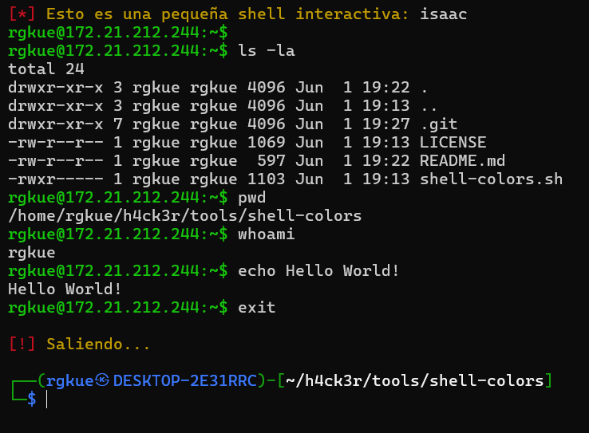

# Shell-Colors.sh

Esta es una simple shell que empecé a hacer con la finalidad de practicar en *Bash Scripting*. Es algo muy básico pero lo importante fue el uso de colores a través de los **Códigos de Escape ANSI**, así como la práctica de lógica y sintaxis en Bash.

---

Seguramente en el futuro use este repositorio como práctica para llevar *Control de Versiones* del mismo script en **Github**. Si quieres saber más sobre mí ;) Te invito a visitar mi portafolio:

> [Isaac Muñoz - Portafolio](https://rgkue.github.io/)

---

## Ejemplo de uso en WSL2

Es bastante mejorable, quizá debí colocar un *"ingresa tu usuario: "* para cambiar el usuario en cada ejecución y hacerlo dínamico?! Btw, para ejecutarlo es simplemente:
* Darle permisos de ejecución `chmod +x shell-colors.sh`
* Ejecutarlo `./shell-colors.sh`

---

Sin más que decir, esto es todo. Happy Hacking! :D

